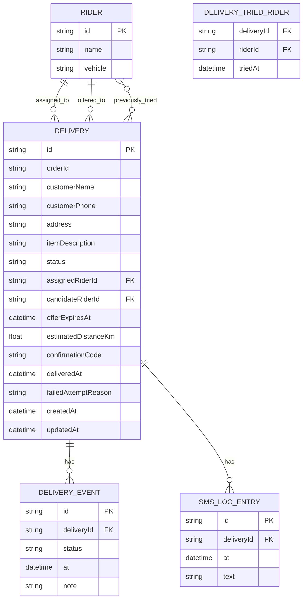

# Entity-relationship diagram — Reflex

The prototype currently stores everything as one JSON array (`deliveries`) in
a single key/value slot (`window.storage` in the original artifact, ported to
`localStorage` in this repo — see `BLOCKERS.md`). Each delivery object embeds
its own `events` and `smsLog` arrays inline.

This document normalizes that shape into the relational model it implies, so
it's ready to hand to a real backend/database (Postgres, MySQL, Supabase,
etc.) if you build one per `BLOCKERS.md` item 1.

## Entities

**RIDER** — the fixed roster of couriers (`RIDERS` constant in `App.jsx`).
In the prototype this is hardcoded; in a real system it'd be a table with
auth, availability, and location fields added.

**DELIVERY** — one row per delivery request. `status` is one of `requested`,
`pending_acceptance`, `unassignable`, `assigned`, `picked_up`, `delivered`,
`failed_attempt`, `cancelled`. `assignedRiderId` is set once a rider accepts;
`candidateRiderId` is set while an offer is outstanding and cleared once it's
accepted, declined, or times out.

**DELIVERY_EVENT** — append-only audit trail shown in the UI's timeline
(`Timeline` component). One row per status change, with a human-readable
`note` (e.g. "Offered to Faith Wanjiru (nearest free rider, 1.8km away)").

**SMS_LOG_ENTRY** — the simulated customer-facing notifications
(`smsLog` in the prototype). Not wired to a real SMS provider — see
`BLOCKERS.md` item 5.

**DELIVERY_TRIED_RIDER** — join table backing `triedRiderIds`: which riders
have already been offered (and passed on) a given delivery, so the dispatch
agent doesn't re-offer them the same job.

## Notes for a future backend

- `RIDER ↔ DELIVERY` has two distinct FK relationships (`assignedRiderId`,
  `candidateRiderId`) rather than one — a rider can simultaneously have
  finished jobs and a pending offer elsewhere.
- `estimatedDistanceKm` and the rider-scoring logic (`scoreRider` in
  `App.jsx`) are currently a deterministic hash-based simulation standing in
  for real GPS distance — flagged in the source code's own comments.
