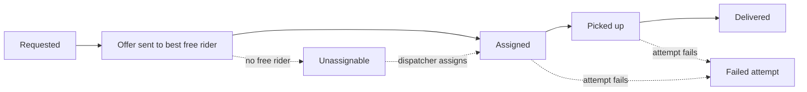
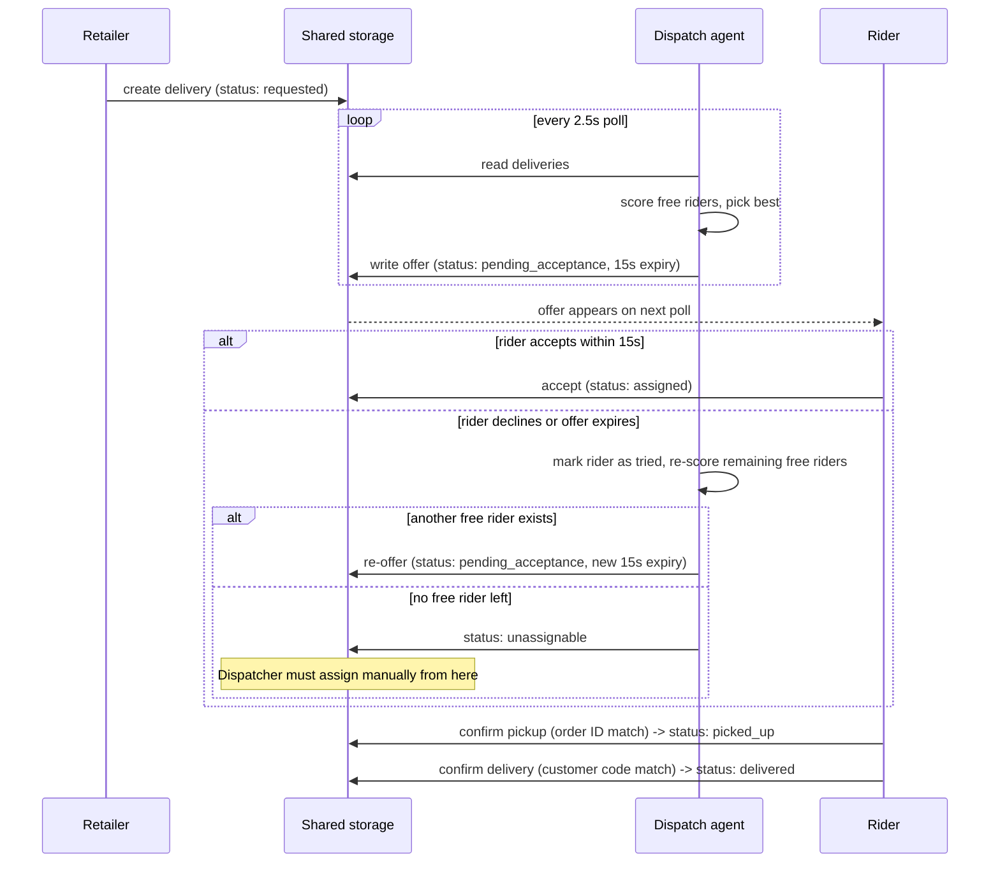
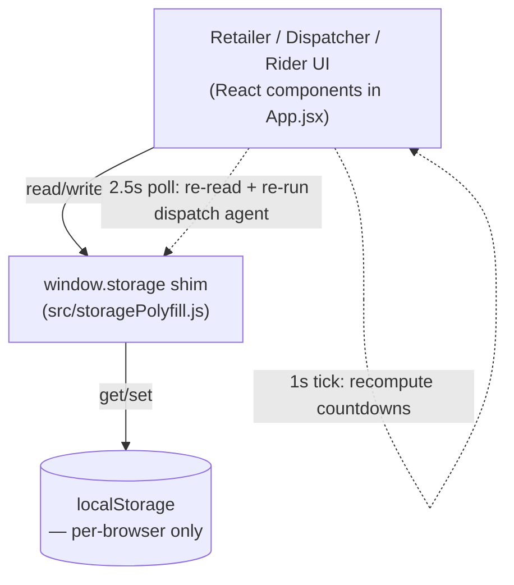

# System design — Reflex

## Roles

Three views over one shared dataset, switched from the header — no separate
logins in the prototype:

- **Retailer** — creates delivery requests, watches their status.
- **Dispatcher** — watches everything, manually assigns/reassigns anything
  the automatic agent couldn't place.
- **Rider** — accepts/declines incoming offers, confirms pickup and delivery.

## Order lifecycle

## Dispatch agent (automatic rider matching)

Runs as a client-side loop (`runDispatchAgent` in `App.jsx`), re-evaluated
every dispatch tick:

1. For every delivery in `requested` or `unassignable` state, look at the
   pool of riders who are (a) not already busy on another job and (b) not
   already tried-and-declined for this one.
2. Score each candidate: base score = simulated distance in km; subtract a
   bonus if the rider has previously delivered in the same area (familiarity);
   subtract a smaller bonus for riders with a lighter total workload, so jobs
   don't pile onto the same one or two people.
3. Offer the job to the lowest-scoring (best) rider, with a 15-second
   acceptance window (`OFFER_WINDOW_MS`).

If accept/decline never resolves it because every rider is busy or has
already declined, the delivery lands in `unassignable` and surfaces in the
Dispatcher view for a manual override (`assignDelivery` / `reassignDelivery`).

## Data flow / storage layer

**This is the single most important architectural fact to know before
extending this repo:** in the original Claude Artifact, `window.storage` was
backed by a real multi-user server, so every viewer saw one live, shared
board. This repo's `storagePolyfill.js` swaps that for `localStorage` so the
UI code didn't need to change — but `localStorage` is scoped to one browser.
Until a real backend is added (see `BLOCKERS.md` item 1), each person who
opens the app has their own independent copy of the data, not a shared one.

## Confirmation flow (pickup / delivery)

Both pickup and delivery share the same `CodeConfirmModal` component and
interaction: a simulated 1.6s "scanning" animation, then a manual-entry
fallback, matching against `orderId` (pickup) or `confirmationCode`
(delivery). A mismatch shows a retryable error state; a match writes the new
status, appends a `DELIVERY_EVENT`, and appends a simulated `SMS_LOG_ENTRY`.
See `docs/ERD.md` for how those two tables relate to `DELIVERY`.
